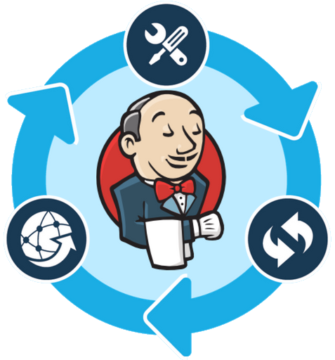

# DevOps Jenkins Modules


### Devops Groovy Module files import
- Orig Ref @ https://github.com/jenkinsci/pipeline-examples/blob/master/pipeline-examples/load-from-file/pipeline.groovy
```
node {
    // Load the file 'externalMethod.groovy' from the current directory, into a variable called "externalMethod".
    def externalMethod = load("externalMethod.groovy")

    // Call the method we defined in externalMethod.
    externalMethod.lookAtThis("Steve")

    // Now load 'externalCall.groovy'.
    def externalCall = load("externalCall.groovy")

    // We can just run it with "externalCall(...)" since it has a call method.
    externalCall("Steve")
}
```


### USE CASE EXAMPLE

```
node {
    gitJenkinsModName = 'jenkins_modules'
    gitJenkinsModCredentialsId = 'jenkins_id_rsa'
    gitJenkinsModRepoUrl = 'bitbucket.org-access-keys:project/devops-jenkins-modules.git'
    gitJenkinsModBranch = 'master'
    gitJenkinsModVersionTag = 'v0.0.1'

    stage("Checkout ${gitJenkinsModName} Repo code") {
        dir("${gitJenkinsModName}") {
            git branch: gitJenkinsModBranch,
                    credentialsId: gitJenkinsModCredentialsId,
                    url: gitJenkinsModRepoUrl

            sh "git checkout tags/${gitJenkinsModVersionTag}"
        }

        def rootDir = pwd()
        jenkinsModulesPath = "${rootDir}/jenkins_modules"
        slackHelper = load "${jenkinsModulesPath}/slack/notification.groovy"
        parameterStoreHelper = load "${jenkinsModulesPath}/aws/ssm/parameter-store.groovy"
    }

    stage("Call slackHelper module to Notify Start exec"){
        slackHelper.sendBuildStatus('STARTED')

    }

    stage ("Get Vault Unseal Keys") {
        def allParams = parameterStoreHelper.getParameters("/devops/vault/")
        // https://jenkins.io/doc/pipeline/steps/credentials-binding/
        withCredentials([string(credentialsId: "jenkins-vault-unseal-fake-credentials", variable: "jenkinsVaultUnsealFakeCredentials")]) {
            sh """
                    set +x
                    export VAULT_ADDR='http://0.0.0.0:8200'
                    vault operator unseal ${allParams['unseal_key_1']}
                    vault operator unseal ${allParams['unseal_key_2']}
                    vault operator unseal ${allParams['unseal_key_3']}

                    # This next line is only to force Jenkins to hide all commands,
                    # their outputs should be covered by the +x
                    #echo ${jenkinsVaultUnsealFakeCredentials} > /dev/null
                """
        }
    }

    stage("Call slackHelper module to Notify Successful exec"){
        slackHelper.sendBuildStatus('SUCCESS')
    }
}
```